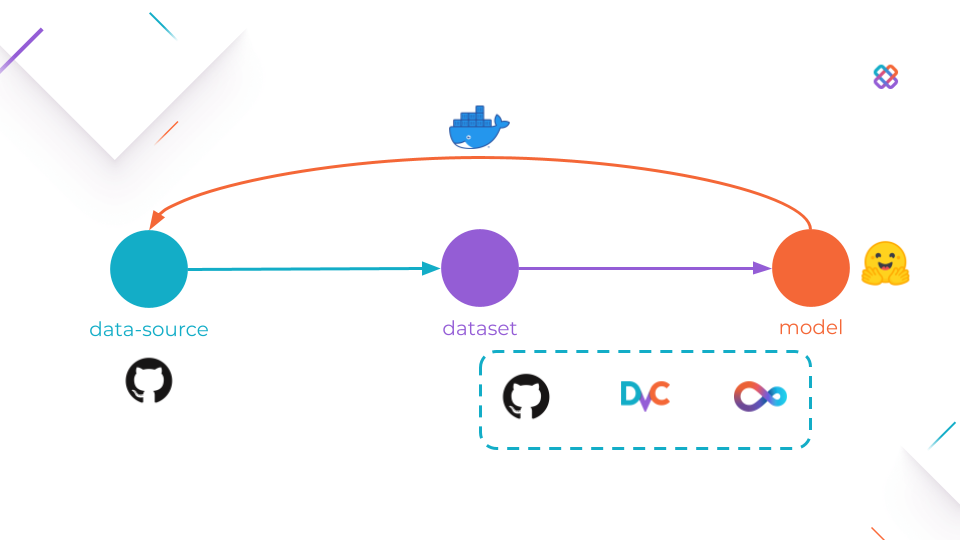
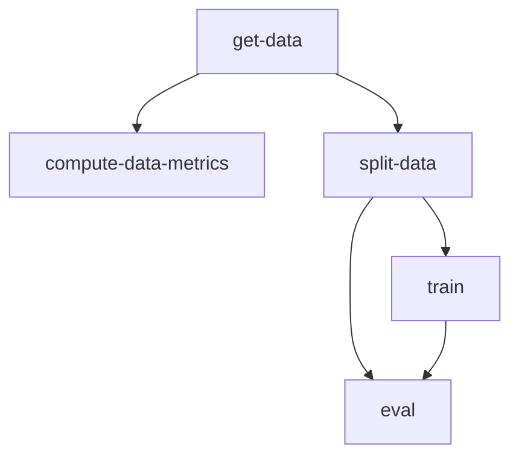
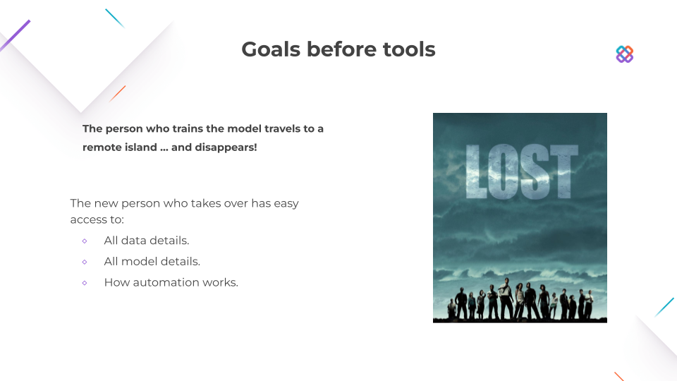
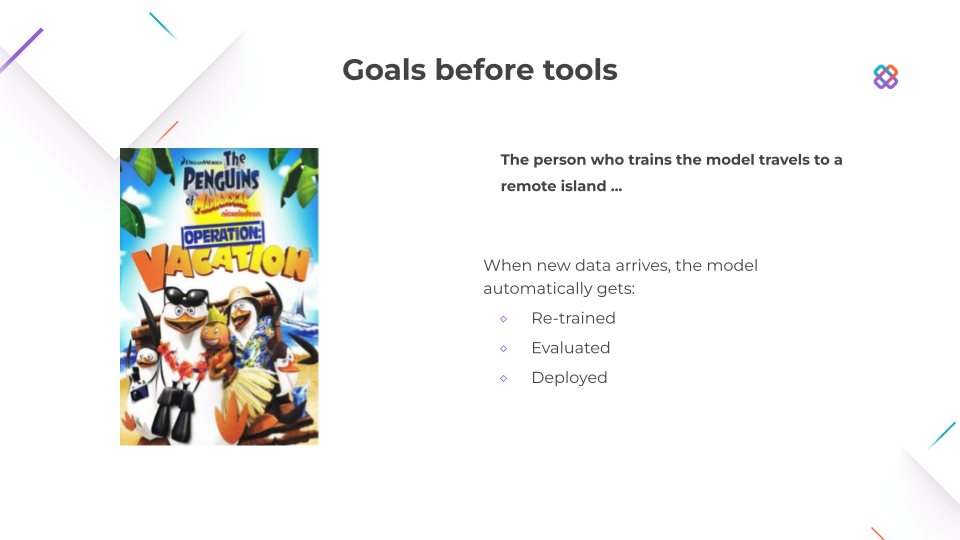

# workshop-uncool-mlops



- :star: -> https://github.com/iterative/dvc
- :star: -> https://github.com/iterative/dvclive
- :star: -> https://github.com/iterative/cml
- :star: -> https://github.com/huggingface/transformers

## Before MLOps

We have a [DVC Pipeline](https://dvc.org/doc/user-guide/project-structure/pipelines-files) defined in [dvc.yaml file](./dvc.yaml).

The pipeline is composed of stages using Python scripts, defined in [src](./src/):



We use [DVC Params](https://dvc.org/doc/command-reference/params), defined in [params.yaml](./params.yaml), to configure the pipeline.

The pipeline can be reproduced locally:

<details>
<summary> Local Reproducibility
</summary>

```
git clone git@git@github.com:iterative/workshop-uncool-mlops.git
cd workshop-uncool-mlops
```

```
pip install -r requirements.txt
```

```
dvc repro
```

</details>

This generates [DVC Metrics](https://dvc.org/doc/command-reference/metrics) and [DVC Plots](https://dvc.org/doc/command-reference/plots) to evaluate model performance, which can be found in [outs](./outs)

These files are small enough to be tracked by git, so after we run the pipeline we can share the results with others:

```
git add `dvc.lock` outs
git push
```

---

### Viewing Results in Studio

- Go to https://studio.iterative.ai (It's free)
- Connect your GitHub account.
- Add a new view.

https://studio.iterative.ai/user/daavoo/views/workshop-uncool-mlops-5fgmd70rkt

More info:

https://dvc.org/doc/studio

## Towards MLOps

You should be able to follow all the steps bellow without leaving the browser.

---

### 1. Fork this repo

- https://github.com/iterative/workshop-uncool-mlops

---

### 2. Open fork in online code editor

Navigate to your for fork and press `.` or change the URL from "github.com" to "github.dev"

---

### 3. Setup DVC Remote

DVC remotes provide a location to store arbitrarily large files and directories.

First, you need to create a new folder on our [Google Drive](https://drive.google.com), navigate to the folder and copy the last part of the URL.

You can now add a DVC remote to our project:

<details>
<summary>From web</summary>

Add the following content to `.dvc/config`:

```
[core]
    remote = myremote
['remote "myremote"']
    url = gdrive://{YOUR_URL}
```

</details>

<details>
<summary>From CLI</summary>

```bash
dvc remote add --default  gdrive://{YOUR_URL}
```

</details>

More info:

https://dvc.org/doc/command-reference/remote/add#description

Other remote?:

https://dvc.org/doc/command-reference/remote/add#supported-storage-types

---

The results of the pipeline can now be shared with others by using [dvc push](https://dvc.org/doc/command-reference/push) and [dvc pull](https://dvc.org/doc/command-reference/pull).

You will be prompted for Google Drive credentials the first time you run `dvc push/pull`.

<details>
<summary> Shared Reproducibility
</summary>

```bash
# Researcher A
# Updates hparam
dvc repro
git add . git commit -m "Updated hparam"
git push && dvc push
```

```bash
# Researcher B
git pull && dvc pull
# Receives all changes
```

</details>

---

### 4. Reproducibility from anywhere, by anyone 

You need to grant GitHub access to the DVC Remote:

<details>
<summary>From web</summary>

- Get the credentials:
https://colab.research.google.com/drive/1Xe96hFDCrzL-Vt4Zj-cVHOxUgu-fyuBW

- Create a new GitHub Secret: `secrets.GDRIVE_CREDENTIALS_DATA`

</details>

<details>
<summary>From CLI</summary>

- Get the credentials:

```bash
cat ".dvc/tmp/gdrive-user-credentials.json"
```

- Create a new GitHub Secret: `secrets.GDRIVE_CREDENTIALS_DATA`

</details>

Then, you can create a workflow that runs when a Pull Request is created:

<details>
<summary>Create and fill `.github/workflows/on_pr.yml`</summary>

```yaml
name: DVC & CML Workflow

on:
  pull_request:

  # Allows you to run this workflow manually from the Actions tab
  workflow_dispatch:

jobs:
  build:
    runs-on: ubuntu-latest
    container: docker://ghcr.io/iterative/cml:latest

    steps:
      - uses: actions/checkout@v2
        with:
        fetch-depth: 0

      - name: Setup
        run: |
          pip install -r requirements.txt

      - name: Run DVC pipeline
        env:
          GITHUB_TOKEN: ${{ secrets.GITHUB_TOKEN }}
          GDRIVE_CREDENTIALS_DATA: ${{ secrets.GDRIVE_CREDENTIALS_DATA }}
        run: |
          dvc repro --pull

      - name: Share changes
        env:
          GDRIVE_CREDENTIALS_DATA: ${{ secrets.GDRIVE_CREDENTIALS_DATA }}
        run: |
          dvc push

    - name: Create a P.R. with CML 
        env:
          REPO_TOKEN: ${{ secrets.GITHUB_TOKEN }}
        run: |
          cml pr "outs.*" "dvc.lock"

    - name: CML Report
        env:
          REPO_TOKEN: ${{ secrets.GITHUB_TOKEN }}
        run: |
          echo "## Metrics & Params" >> report.md

          dvc exp diff solution --show-md >> report.md
          cml send-comment --pr --update report.md
                  
          echo "## Plots" >> report.md

          echo "### Eval Loss" >> report.md
          dvc plots diff \
            --target outs/train_metrics/scalars/eval_loss.tsv --show-vega solution > vega.json
          vl2png vega.json -s 1.5 | cml-publish --md  >> report.md

          echo "### Eval Accuracy" >> report.md
          dvc plots diff \
            --target outs/train_metrics/scalars/eval_accuracy.tsv --show-vega solution > vega.json
          vl2png vega.json -s 1.5 | cml-publish --md  >> report.md

          echo "### Confusion Matrix" >> report.md
          dvc plots diff \
            --target outs/eval/plots/confusion_matrix.json --show-vega solution > vega.json
          vl2png vega.json -s 1.5 | cml-publish --md  >> report.md

          cml send-comment --pr --update report.md
```
</details>

And now you can reproduce the pipeline from the web:

<details>
<summary>From GitHub</summary>

- Edit `params.yaml` from the GitHub Interface.

- Change `train.epochs`.

- Select `Create a new branch for this commit and start a pull request`

</details>

<details>
<summary>From Studio</summary>

- https://studio.iterative.ai/user/daavoo/views/workshop-uncool-mlops-5fgmd70rkt

- Click on `Run new experiment` button

</details>



--

### 5. Automation

You can also create a workflow that runs on a daily schedule:

<details>
<summary>Create and fill `.github/workflows/daily.yml`</summary>

```yaml
name: Daily DVC & CML Workflow

on:
  schedule:
    - cron: "0 0 * * *"

  # Allows you to run this workflow manually from the Actions tab
  workflow_dispatch:

jobs:
  build:
    runs-on: ubuntu-latest
    container: docker://ghcr.io/iterative/cml:latest

    steps:
      - uses: actions/checkout@v2
        with:
        fetch-depth: 0

      - name: Setup
        run: |
          pip install -r requirements.txt

      - name: Run DVC pipeline
        env:
          GITHUB_TOKEN: ${{ secrets.GITHUB_TOKEN }}
          GDRIVE_CREDENTIALS_DATA: ${{ secrets.GDRIVE_CREDENTIALS_DATA }}
        run: |
          dvc exp run --set-param until=$(date +'%Y/%m/%d') --pull

      - name: Share changes
        env:
          GDRIVE_CREDENTIALS_DATA: ${{ secrets.GDRIVE_CREDENTIALS_DATA }}
        run: |
          dvc push

    - name: Create a P.R. with CML 
        env:
          REPO_TOKEN: ${{ secrets.GITHUB_TOKEN }}
        run: |
          cml pr "outs.*" "dvc.lock"

    - name: CML Report
        env:
          REPO_TOKEN: ${{ secrets.GITHUB_TOKEN }}
        run: |
          echo "## Metrics & Params" >> report.md

          dvc exp diff solution --show-md >> report.md
          cml send-comment --pr --update report.md
                  
          echo "## Plots" >> report.md

          echo "### Eval Loss" >> report.md
          dvc plots diff \
            --target outs/train_metrics/scalars/eval_loss.tsv --show-vega solution > vega.json
          vl2png vega.json -s 1.5 | cml-publish --md  >> report.md

          echo "### Eval Accuracy" >> report.md
          dvc plots diff \
            --target outs/train_metrics/scalars/eval_accuracy.tsv --show-vega solution > vega.json
          vl2png vega.json -s 1.5 | cml-publish --md  >> report.md

          echo "### Confusion Matrix" >> report.md
          dvc plots diff \
            --target outs/eval/plots/confusion_matrix.json --show-vega solution > vega.json
          vl2png vega.json -s 1.5 | cml-publish --md  >> report.md

          cml send-comment --pr --update report.md
```
</details>



### 6. Deployment

For deployment you can create a workflow that builds and deploys a docker images.

<details>
<summary>Create and fill `Dockerfile`</summary>

```docker
FROM huggingface/transformers-pytorch-cpu:latest

COPY outs/train model
COPY src/inference.py inference.py

RUN pip3 install fire loguru

ENTRYPOINT ["python3", "inference.py", "model"]
```
</details>

<details>
<summary>Create and fill `.github/workflows/deploy_docker.yml`</summary>

```yaml
name: Create and publish a Docker image

on:
  push:
    branches:
      - 'main'
    tags:
      - 'v*'

env:
  REGISTRY: ghcr.io
  IMAGE_NAME: ${{ github.repository }}

jobs:
  build-and-push-image:
    runs-on: ubuntu-latest
    permissions:
      contents: read
      packages: write

    steps:
      - name: Checkout repository
        uses: actions/checkout@v2

      - name: Log in to the Container registry
        uses: docker/login-action@f054a8b539a109f9f41c372932f1ae047eff08c9
        with:
          registry: ${{ env.REGISTRY }}
          username: ${{ github.actor }}
          password: ${{ secrets.GITHUB_TOKEN }}

      - name: Extract metadata (tags, labels) for Docker
        id: meta
        uses: docker/metadata-action@98669ae865ea3cffbcbaa878cf57c20bbf1c6c38
        with:
          images: ${{ env.REGISTRY }}/${{ env.IMAGE_NAME }}
  
      - name: Setup
        env:
          GDRIVE_CREDENTIALS_DATA: ${{ secrets.GDRIVE_CREDENTIALS_DATA }}
        run: |
          pip install dvc[gdrive]
          dvc pull outs/train
  
      - name: Build and push Docker image
        uses: docker/build-push-action@ad44023a93711e3deb337508980b4b5e9bcdc5dc
        with:
          context: .
          push: true
          tags: ${{ steps.meta.outputs.tags }}
          labels: ${{ steps.meta.outputs.labels }}

```
</details>

You can use the published image from anywhere:

<details>
<summary>Example github workflow</summary>

```yaml
name: Issue Labeler

on:
  issues:
    types: [opened]

jobs:
  predict:
    runs-on: ubuntu-latest
    strategy:
      matrix:
        model: ["ghcr.io/iterative/workshop-uncool-mlops:main"]
    steps:
      - name: Model Predict
        run: docker run ${{ matrix.model }} "${{ github.event.issue.title }}" "${{ github.event.issue.body }}"
```
</details>

<details>
<summary>Using locally</summary>

```bash
docker run "ghcr.io/iterative/workshop-uncool-mlops:main" "dvc pull fails when using my S3 remote"
```
</details>
