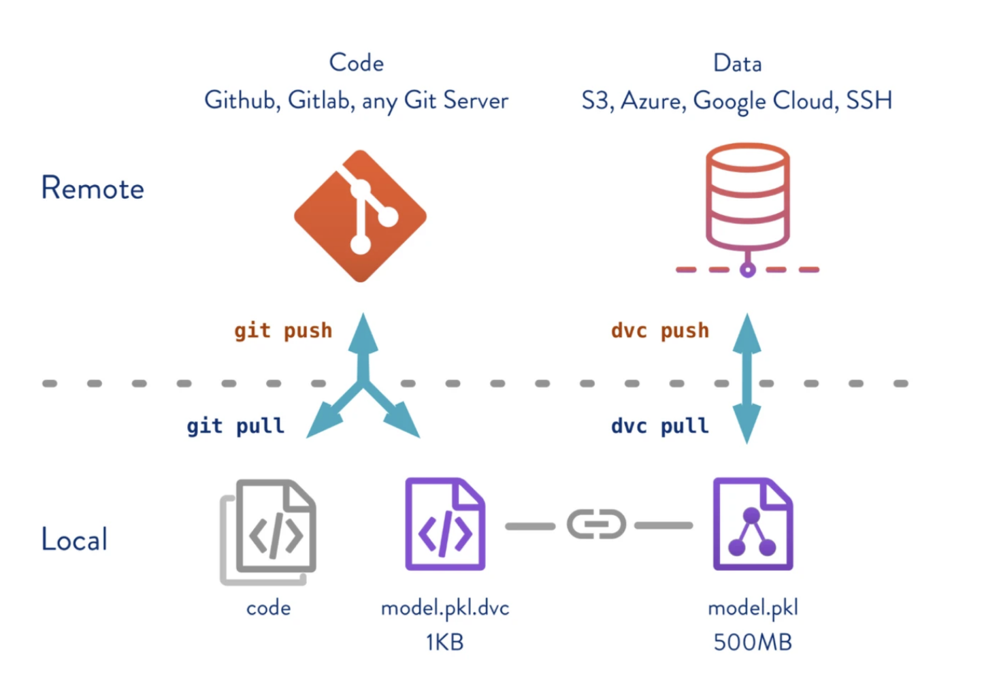

# Shared Reproducibility

DVC remotes provide a location to store arbitrarily large files and directories.



First, you need to create a new folder on our [Google Drive](https://drive.google.com), navigate to the new folder and copy the last part of the URL.


You can now add a DVC remote to our project:

```bash
dvc remote add --default myremote gdrive://{COPY PASTED GDRIVE URL}
```

---

> More info: https://dvc.org/doc/command-reference/remote/add#description

---

The results of the pipeline can now be shared with others by using [dvc push](https://dvc.org/doc/command-reference/push) and [dvc pull](https://dvc.org/doc/command-reference/pull).

```console
dvc push -j 4
```

You will be prompted for Google Drive credentials the first time you run `dvc push/pull`.


```bash
# Researcher A
# Updates hparam
dvc repro
git add . git commit -m "Updated hparam"
git push && dvc push
```

```bash
# Researcher B
git pull && dvc pull
# Receives changes
```

## Other Remotes

This commands works the same regardless of the remote type. See all the available remotes:

https://dvc.org/doc/command-reference/remote/add#supported-storage-types
