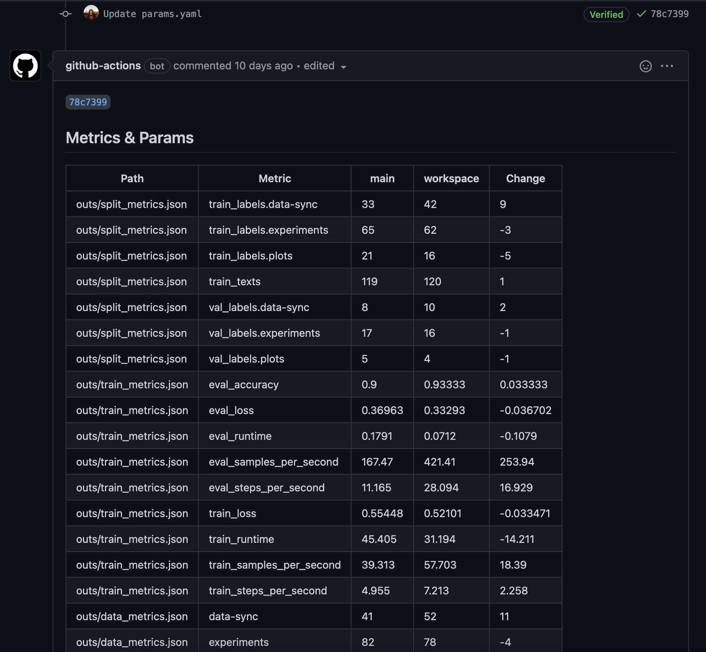
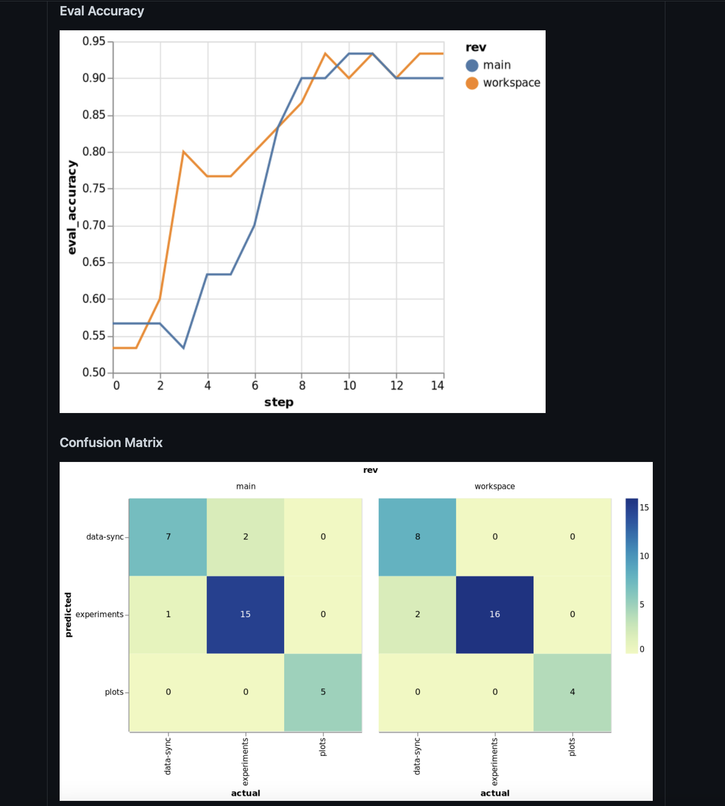

# Online Reproducibility

## Add new secret PERSONAL_GITHUB_TOKEN.

- Create a personal access token

https://docs.github.com/en/authentication/keeping-your-account-and-data-secure/creating-a-personal-access-token

- Create a new secret and name it `PERSONAL_GITHUB_TOKEN`

## Grant GitHub access to DVC Remote

You need to grant GitHub access to the DVC Remote.

Get the credentials.

```bash
cat ".dvc/tmp/gdrive-user-credentials.json"
```

And create a new GitHub secret called `GDRIVE_CREDENTIALS_DATA` to store them.

With this, GitHub runners will be able to pull and push all the changes generated by the pipeline.

## Pull Request workflow

You can create a new *GitHub actions workflow* that runs when a new Pull Request is created.

This workflow will use `DVC` to reproduce the pipeline and update the large artifacts tracked by DVC.

In addition it will use `CML` to post a **report** with the `DVC` metrics, params, and plots ([cml send-comment](https://cml.dev/doc/ref/send-comment)). It will also update the artifacts tracked by Git ([cml pr](https://cml.dev/doc/ref/pr))





<details>
<summary>Create and fill `.github/workflows/on_pr.yml`</summary>

https://github.com/iterative/workshop-uncool-mlops-solution/blob/main/.github/workflows/on_pr.yaml

</details>

## Reproduce Online

And now you can reproduce the pipeline from the web:

### From GitHub UI

- Edit `params.yaml` from the GitHub Interface.

- Change `train.epochs`.

- Select `Create a new branch for this commit and start a pull request`

### From Studio

- Go to https://studio.iterative.ai (It's free)
- Connect your GitHub account.
- Add a new view.

> More info: https://dvc.org/doc/studio

- Click on `Run new experiment` button.

## More compute

In the above workflow we are using the default GitHub runners to train our model.

While this is enough for our use case (small dataset, small model), your project would often require more compute resources.

[CML Self-Hosted Runners](https://cml.dev/doc/self-hosted-runners) allows you to allocate cloud instances (or on-premise machines) and use them in your GitHub actions workflow.
