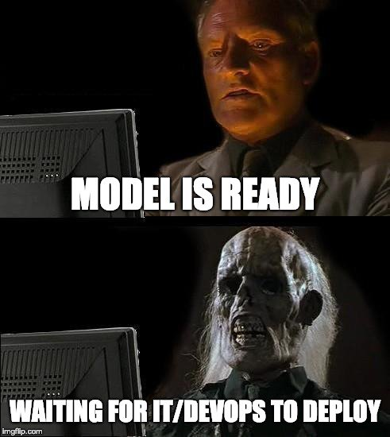

# Deployment

Now that GitHub has access to our DVC Remote, we can automate the deploymend of our model.



In our case, we will create a workflow that builds a docker image and deploys it to [GitHub's Container registry](https://docs.github.com/en/packages/working-with-a-github-packages-registry/working-with-the-container-registry).

First, we create a Dockerfile that wraps our model and uses the [inference script](../src/inference.py)

<details>
<summary>Create and fill `Dockerfile`</summary>

```dockerfile
FROM huggingface/transformers-pytorch-cpu:latest

COPY outs/train model
COPY src/inference.py inference.py

RUN pip3 install fire loguru

ENTRYPOINT ["python3", "inference.py", "model"]
```

</details>

Now, we can create a new GitHub workflow that gets the latest model from the DVC remote, builds a new image and
publish it to the container registry.

<details>
<summary>Create and fill `.github/workflows/deploy_model.yml`</summary>

```yaml
name: Create and publish a Docker image

on:
  push:
    branches:
      - 'main'
    tags:
      - 'v*'

env:
  REGISTRY: ghcr.io
  IMAGE_NAME: ${{ github.repository }}

jobs:
  build-and-push-image:
    runs-on: ubuntu-latest
    permissions:
      contents: read
      packages: write

    steps:
      - name: Checkout repository
        uses: actions/checkout@v2

      - name: Log in to the Container registry
        uses: docker/login-action@f054a8b539a109f9f41c372932f1ae047eff08c9
        with:
          registry: ${{ env.REGISTRY }}
          username: ${{ github.actor }}
          password: ${{ secrets.GITHUB_TOKEN }}

      - name: Extract metadata (tags, labels) for Docker
        id: meta
        uses: docker/metadata-action@98669ae865ea3cffbcbaa878cf57c20bbf1c6c38
        with:
          images: ${{ env.REGISTRY }}/${{ env.IMAGE_NAME }}
  
      - name: Setup
        env:
          GDRIVE_CREDENTIALS_DATA: ${{ secrets.GDRIVE_CREDENTIALS_DATA }}
        run: |
          pip install dvc[gdrive]
          dvc pull outs/train
  
      - name: Build and push Docker image
        uses: docker/build-push-action@ad44023a93711e3deb337508980b4b5e9bcdc5dc
        with:
          context: .
          push: true
          tags: ${{ steps.meta.outputs.tags }}
          labels: ${{ steps.meta.outputs.labels }}
```
</details>

Once this has been merged and the first image published, we can use it from anywhere:

```console
docker run "ghcr.io/daavoo/workshop-uncool-mlops:main" "dvc pull fails when using my S3 remote"
{"label": "data-sync", "score": 0.8273094296455383}
```

This also allows to use the image inside other GitHub workflows. We can create a new workflow that gets triggered
whenever a new issue is created and uses the wrapped model to automatically assign a new label:

<details>
<summary>Create and fill `.github/workflows/issue_labeler.yml`</summary>

```yaml
name: Issue Labeler

on:
  issues:
    types: [opened]

jobs:
  predict:
    runs-on: ubuntu-latest
    steps:
      - name: Model Predict
        run: |
            docker run ghcr.io/daavoo/workshop-uncool-mlops:main "${{ github.event.issue.title }}" > result.json
      - name: Get Label
        id: get-label
        run: echo "::set-output name=label::$(jq '.label' result.json -r)"
      - name: Add Label
        uses: actions-ecosystem/action-add-labels@v1
        with:
          labels: ${{ steps.get-label.outputs.label }}
```

</details>

Create a new issue and check the workflow and the added label.
